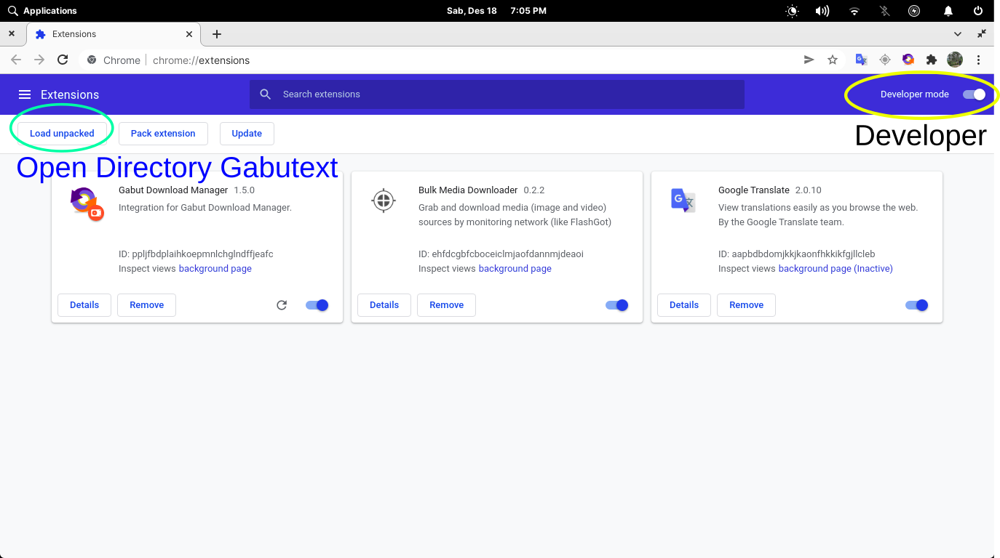
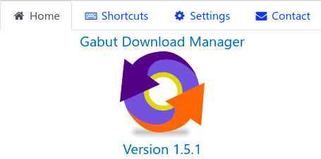
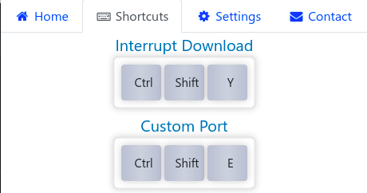
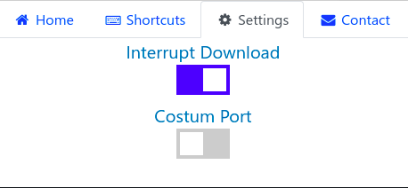
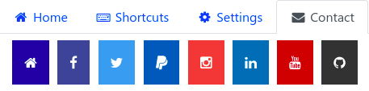

# Gabut Extensions
<h1 align="center">
     
    
</h1>
<h4 align="center">Extensions for Gabut Download Manager</h4>

    
    

Extensions Browser

Integration for Gabut Download manager.

Extensions created to send the url of an internet browser to the gabut download manager.

Try gabut ext on google chrome

